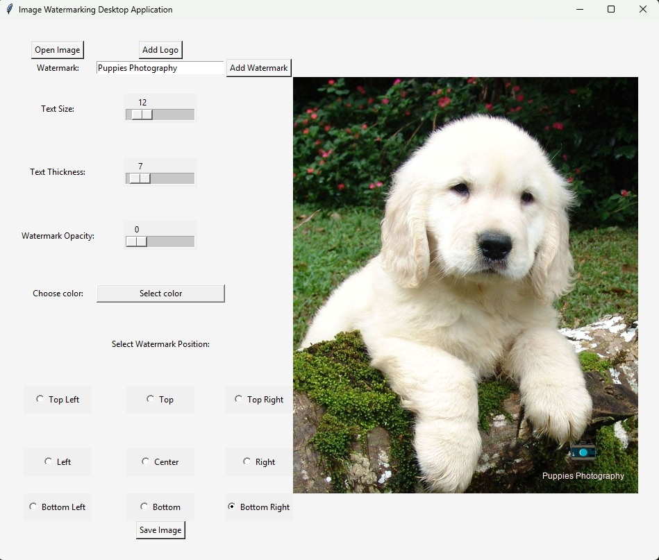

# Image Watermarking Desktop App

A simple desktop application built with Python and Tkinter that allows users to add text and logo watermarks to images.

The app uses Pillow for image processing and Tkinter for the graphical interface.

## 🖼 Preview



---

## Features

- Open an image from your computer
- Add a logo watermark
- Add a text watermark
- Choose watermark position
- Change text size
- Change text thickness
- Change text opacity
- Choose text color
- Preview changes before saving
- Save the final image at its original resolution

## Technologies Used

- Python
- Tkinter
- Pillow

## Installation

Clone the repository:

```bash
git clone https://github.com/IliescuMonica/-Image-Watermarking-Desktop-App.git
